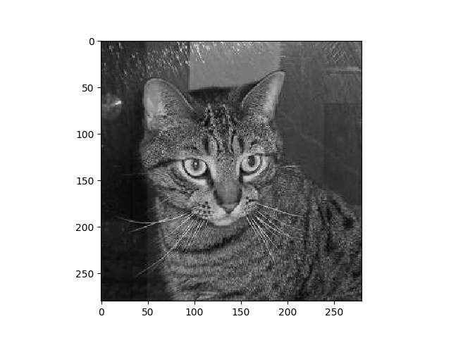
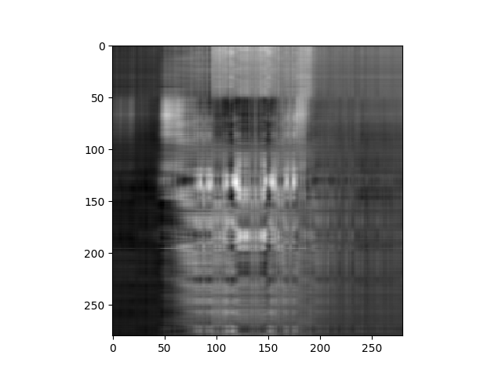

# Image Geometry

## Consider this 280x280 greyscale image of a cat.

## This is just one point in a 78400 dimensional vector space. There are a total of 255^78400 possible greyscale images. In this script, we explore the local images around our image of a cat.

## Computing the SVD and constructing the compressed representation with only 10 singular values gives an image which humans would still clasify as a cat.

## Whereas 5 singular values looks more like noise.

## Adding random noise is still looks like a cat
