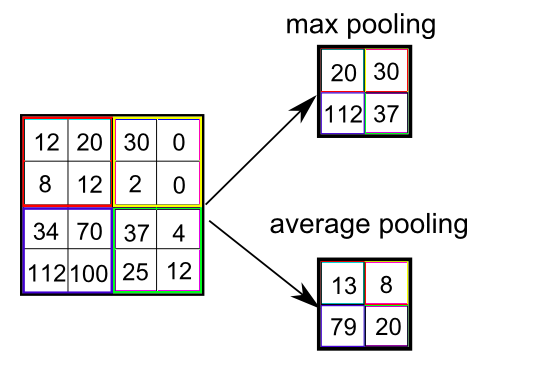

# Neural Structures

### Many different neural network architectures exist. Unsuprisingly, most of them are just standard deep neural networks with hardwired weights or activation functions.

## Convolution
### A convolution layer has proven to help neural networks when dealing with images. The idea is that a single pixel should only be affected by neighbouring pixels and not pixels far away. This would involve setting many weights to zero. This can be taken one step further by enforcing many of the existing weights share values. An example of the convolution operator is shown here:

  

Image credit: https://peltarion.com/knowledge-center/documentation/modeling-view/build-an-ai-model/blocks/2d-convolution-block

### Which can be represented by a standard neural network layer. The weights are represented by the arrows. Two arrows of the same colour represent the same weight and no arrow implies a zero weight.

  

## Pooling
### Pooling is often used along side convolution layers. The idea is to take a small block of the images and squish it into one value.

  

### If we do an average pooling, then the layer can be represented by a single layer. If we wanted to do max pooling then we would have to introduce layer operations. Remember activation functions inside neurons are applied to a scalar, not a vector.

  

## Residual blocks
### ResNet consists of residual blocks. Residual block prevent the vanishing gradient problem by allowing gradients to leap frog layer. The most common type of residual block is this:

  

### Again this can be represented by standard neural network if we introduce neurons with the identifiy as an activation function (red) and edges with weight equal to one (red):

  

