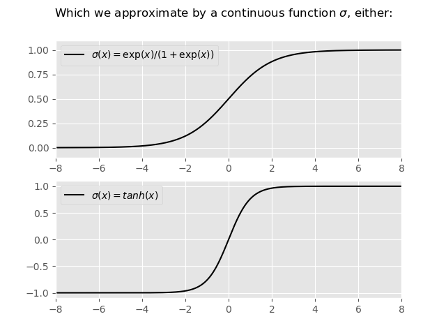
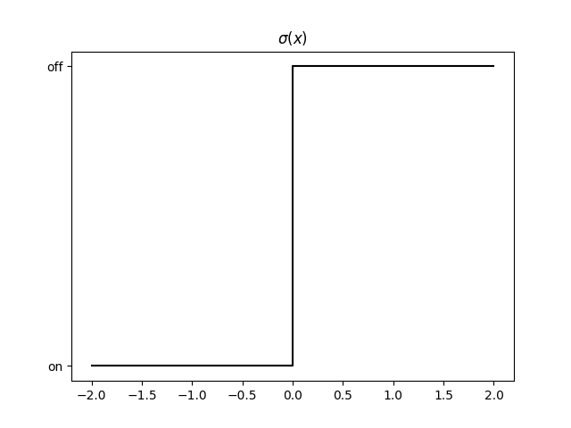
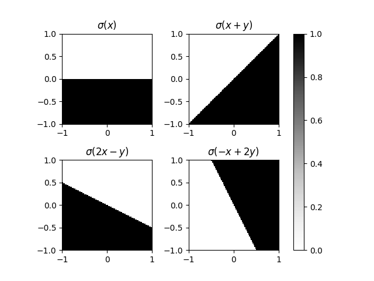
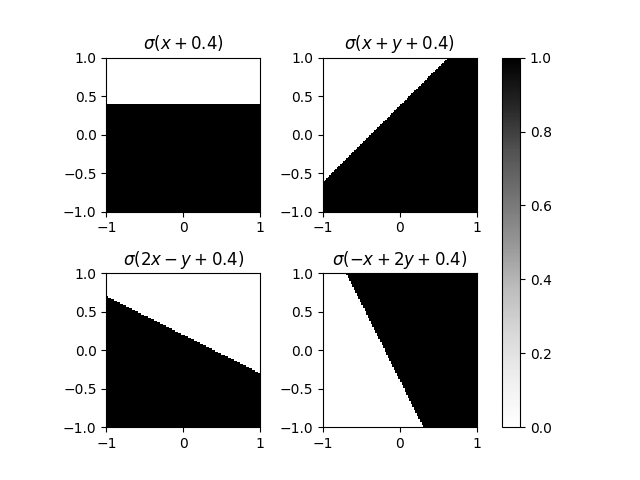
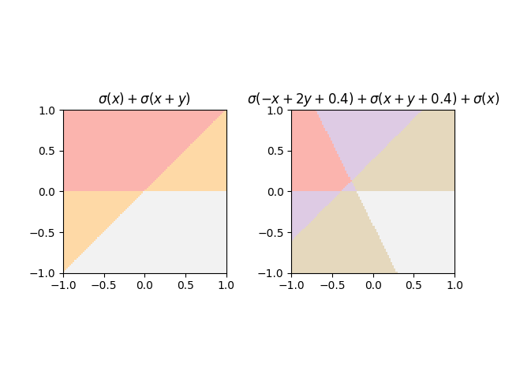
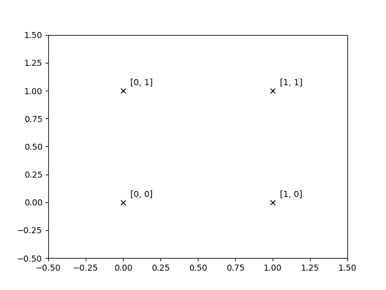

# Neural Networks

### A neuron takes multiple inputs and produces one output

### Inside the neuron we take a weighted sum, add a bias, and apply an activation function

### The activation function behaves like a switch

### And so a neuron partitions the input space, the weights control the direction

### And the bias applies a shift

### Summing multiple neurons allows us to apply multiple partitions

### In practise, we use continous functions which approximate the step function

