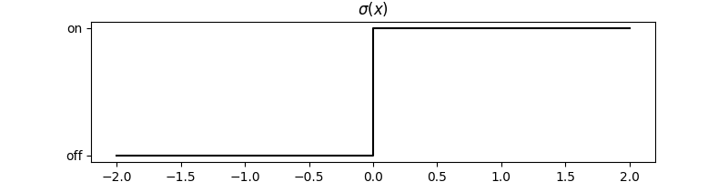

# Neural Networks

## A neuron takes multiple inputs and produces one output

## Inside the neuron we take a weighted sum, add a bias, and apply an activation function

## The activation function behaves like a switch

