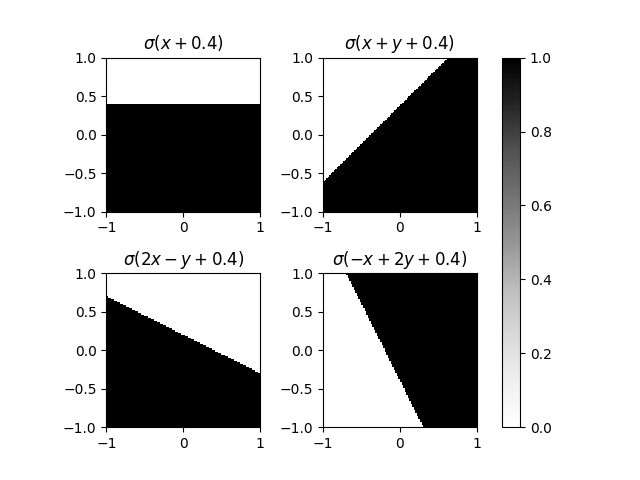
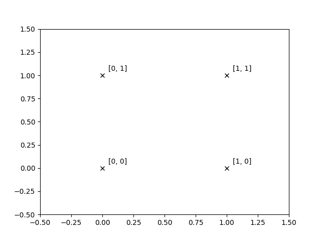

# Neural Networks

### A neuron takes multiple inputs and produces one output:

### Inside the neuron we take a weighted sum, add a bias, and apply an activation function:

### The activation function behaves like a switch:

### And so a neuron partitions the input space, the weights control the direction:

### And the bias applies a shift:

### Summing multiple neurons allows us to apply multiple partitions:

### And with enough neurons, we can partition any space:

### This result is known as the 'Universal Approximation Theorem'. The problem is, we could need many partitions.

### In practise, we use continous functions which approximate the step function

