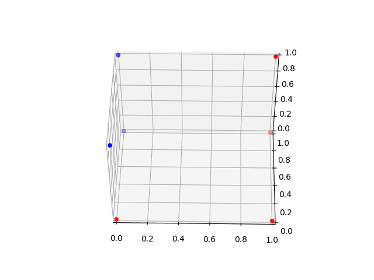
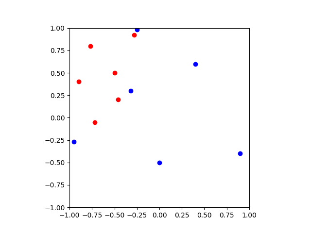

# Neural Networks

### A single neuron takes in multiple inputs (a vector) and produces one output (a scalar):

  

### Inside the neuron we take a linear combination of the inputs, add a bias, and apply a (nonlinear) activation function:

  

### The activation function behaves like a switch:

  

### And so a single neuron simply partitions the vector space. The weights control the direction of the partition:

  

### And the bias applies a shift:

  

### To create more partitions, we need more neurons:

  

### But now the output is a vector equal to number of neurons:

  

### We can represent the new space as node on a hypercube:

  

### An additional layer can be used to partition this new space.

  

### And the output of this second layer is again a hyperplane:

  

### The isolated datapoint [0,1] represents a full region in the first layer:

  

### Consider the following classification problem:

  

### We need three hyperplanes to separate the regions (3 neurons):

  

### The output is three dimensional:

  

### We can visualise these points on a three dimensional hypercube where we can color the nodes according to their class:

  

### A single neuron in a second layer can isolate the blue from the red:

  

### Which corresponds to the following partition:

  

### As we have shown, when using a step function, the first layer divides the space into regions. Two points in the same region are indistinguishable. And the second layer merges regions.

### As the classification problem gets more difficult, we need more neurons:

  

### And this is only a 2 dimensional problem. In practise, we use continous functions instead of the step function:

  

### The region is no longer mapped to two distinct points, and so subsequent layers do a lot more. Visualising the output of a single neuron is easy:

  

### Whereas visualising the output of two neurons is much more difficult. Consider another classification problem:

  

### We can classify this region with a 2-1 layer neural network with sigmoid activation functions. The first layer has two neurons

  

  

### And the second layer has one neuron, and the output is rounded.

  

### Which classifies the region like this:

  

