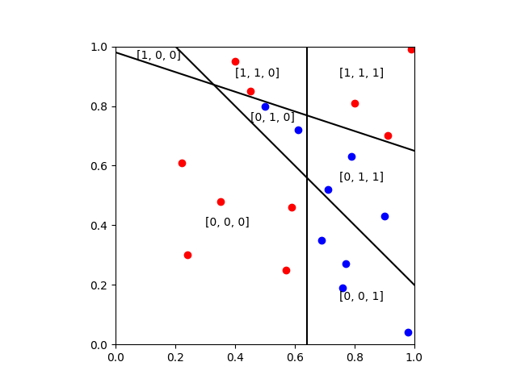

# Neural Networks

### A neuron takes multiple inputs and produces one output:

### Inside the neuron we take a weighted sum, add a bias, and apply an activation function:

### The activation function behaves like a switch:

### And so a neuron partitions the input space where the weights control the direction:

### And the bias applies a shift:

### To create more partitions, we need more neurons:

### And the output is a vector equal to number of neurons:

### We can represent this space as node on a hypercube:

### We could add an additional layer to partition this space.
### Alternatively, we could sum the output of multiple neurons:

### This combines regions:

### And we can keep adding neurons:

### Suppose we wanted to classify the green crosses, with 4 neurons we could have:

### And with 8 neurons:

### If the classification problem became more complex, we could need many neurons:

### In practise, we use continous functions which approximate the step function

### And now the regions become less distinct

