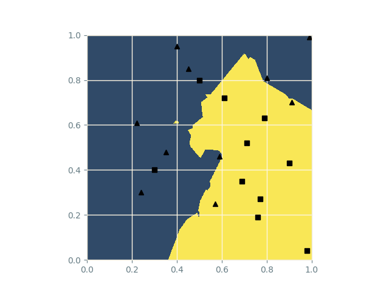
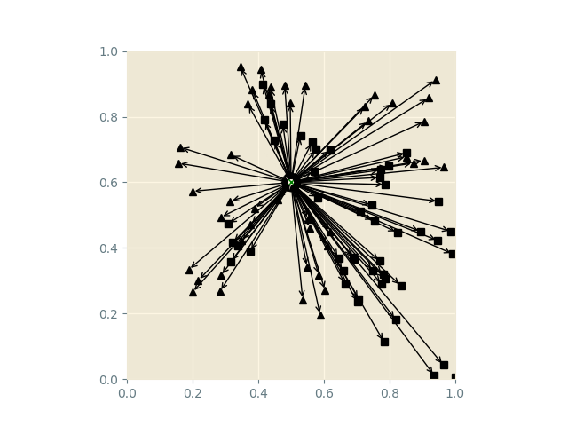
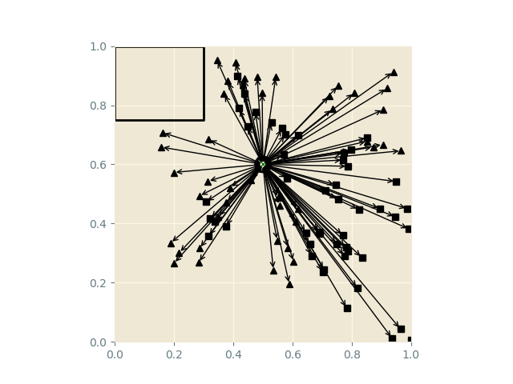

# k Nearest Neighbours

### Consider two classes, blue and red:

### Well which class does the green cross belong to?

### We could look at its nearest neighbour:

### Using this strategy divides the space into two regions:

### Outliers can damage the regions:

### We can remove them by considering more neighbour:

### But considering too many neighbours is also bad:

### The complexity of the algorithm increases as we add more datapoints:

### Which class does the green cross belong to?

### Well we first must compute all these distances:

### And large regions of the space may have no nearby neighbours!

