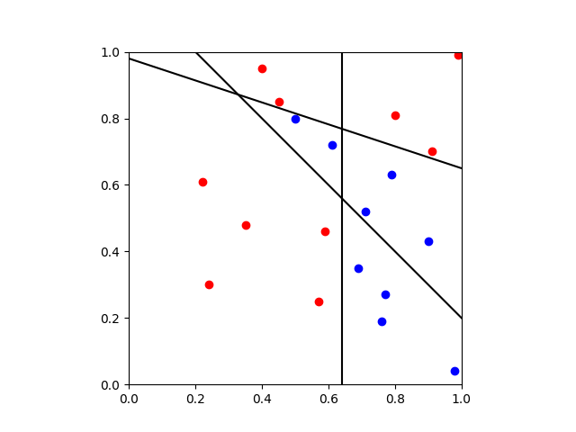
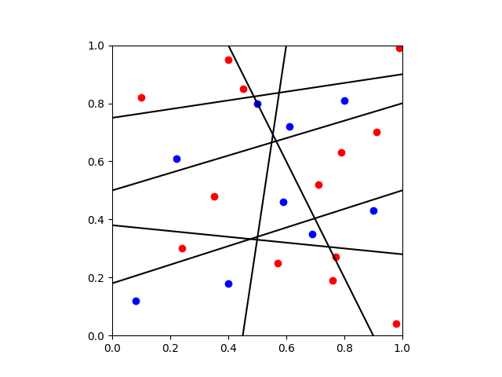
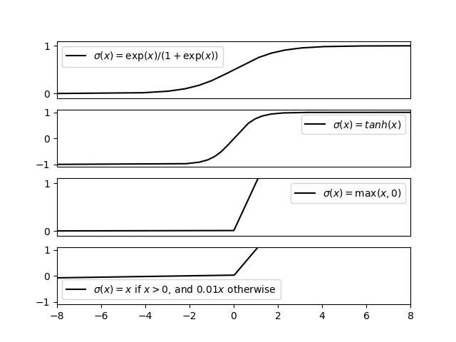
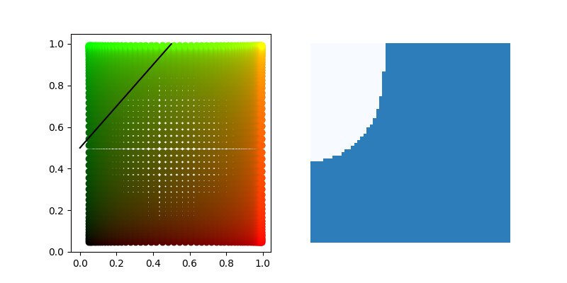

# Neural Networks

### A single neuron takes in multiple inputs (a vector) and produces one output (a scalar):

  

### Inside the neuron we take a linear combination of the inputs, add a bias, and apply a (nonlinear) activation function:

  

### A biological neuron behaves like a switch, there is either an electical current of there is not. We can achieve the same using a step function:

  

### And so a single neuron simply partitions the vector space. The weights control the direction of the partition:

  

### And the bias applies a shift:

  

### A single neuron can only divide the space into two regions. To have more regions, we need more neurons. A layer of n neurons can create at most 2^n regions. Consider just 2 neurons:

  

### Each neuron produces a scalar output, and so the output of n neurons is a vector of length n. Each region is associated to a unique binary vector.

  

### The regions can be represented by nodes on a hypercube:

  

### We can apply additional layers to group the nodes, which in turn groups regions.

  

### The second layer also represents a hyperplane in the new space:

  

### The isolated node [0, 1] represents a full region in the first layer:

  

### Consider the following classification problem:

  

### We need three hyperplanes to carve up the space such that no region contains both a red and blue dot. This corresponds to a single layer with 3 neurons:

  

### The output is three dimensional binary vector:

  

### We can visualise these points on a three dimensional hypercube. The colour of the node represents the class of the notes in the region:

  

### A single hyperplane can isolate the blue nodes from the red nodes:

  

### Which corresponds to the following partition:

  

### As we have shown, when using a step function, the first layer divides the space into regions. Two points in the same region are indistinguishable. Subsequent layers simply merge regions. A more difficult classification problem would need more neurons:

  

### So far we have only considered a 2 dimensional vector space. As the input dimension increases, so would the number of neurons required in the first layer. In practise, we use continous functions instead of the step function. This allows backpropagation and makes subsequent layers more meaningful as we no longer have distinct regions after the first layer. Examples of commonly used activation functions include:

  

### Visualising the output of a single neuron with a continous activation function is easy:

  

### Whereas visualising the output of two neurons is much more difficult. Consider another classification problem:

  

### Suppose our first layer has two neurons with sigmoid activation function.

  

### We can visualise the space by mapping a color plane over it. Most of the points are shifted towards either [0, 0], [0, 1], [1, 0], [1, 1]:

  

### And a second layer with just one neuron again divides the space. If we round the output then we classify the region like so:

  

### A perfect divide. Trying to achieve such a classification would require more neurons if a step function was used. The sigmoid function can achieve anything a step function can by scaling the weights towards infinity:

  

